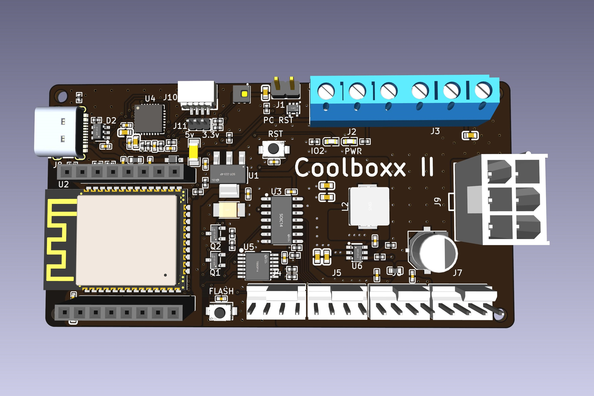
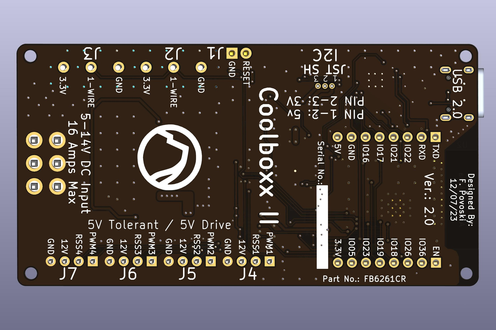

# COOLBOXX II - UPDATED WITH NEW FEATURES 
### BUY - https://www.tindie.com/products/34656/

## Description
VERSION 2.0 UPDATED WITH NEW FEATURES.
MMPOS NOW SUPPORTS COOLBOXX II with agent update.

The Coolboxx II is a ESP32 based board for temperature monitoring and controlling high current PWM fans in Crypto Rigs and other applications that require high airflow. The ESP32 based board features the powerful ESP-WROOM-32E module, with integrated WiFi and Bluetooth functionality (BR/EDR/BLE). The proven ESP32-D0WD-V3 chip is designed with TSMC ultra-low power management technology.

The Coolboxx II's plug-n-play software implements communications via the USB-C port to a Crypto Rig's motherboard running mining operating systems such as HiveO and others (please verify if yours is supported). It allows the OS to manually control fan speeds or set the CoolBoxx II in Automatic Mode to allow the Coolboxx II to automatically control the fans with a rig optimized algorithm that maintains desired target temperatures based on GPU temperatures or the temperature of the case using the onboard or attached DS18B20 sensors. It also has an over-temperature alarm function and monitoring actual fan speed and determines the "health" of your fans.

The Coolboxx II also performs a "watchdog" function based on a programmed timeout to reset the rig in the event of a crash or other event.

The Coolboxx II's USB-C interface is also used for download of firmware. The board is flashed with an ESPHome image to allow immediate inclusion into your Crypto Rig, is WiFi enabled and supports OTA programming. It also has headers that allow the use with conventional D1 Mini style daughter boards and is therefore pin compatible with most accessories. **The board has a JST SH connector with I2C or PDM interface and selectable (3.3/5V) power and ground compatible with Adafruit's STEMMA QT/ Sparkfun Qwiic sensors. With an optional JST SH to JST PH cable, it also supports STEMMA and Grove interfaces. On board is a AHT20 temperature and humidity sensor. It also has a 2-pin header for connecting the motherboard's reset pins implementing a watchdog function. It also has two, 3-pin screw connector for one-wire devices, each with 3.3v power and ground.

The Coolboxx II's has four Molex KK (PC fan style) that has one 5v driven output, one 5v tolerant input, in addition to fan (typ. 12v) power and ground **for 4+ amps per connector and up to 16 amps for all four connectors.** It makes it the perfect board for controlling four or more high air flow fans such as the Wathai 12038 (230 CFM) or the Delta QFR1212GHE (250 CFM) to mention a few.

 

## Specifications:

* Size: 84mm x 44mm with 2mm mounting holes
* Processor: ESP32 on ESP32-WROOM-E module with WiFi and BT V4.2
* Power Input: 12v @ 16 amps max via a 6-pin PCI-e connector or 5v via USB-C connector.
* 16amp input power max.
* On Board Regulation: 5v @ 2 amps switching regulator, 3.3v @ 1.0 amp.
* Onboard AHT20 Temperature and Humidity Sensor.
* Input/Output: One 5v tolerant input (1k pullup) and one 5v driven output, with 12V power (4+ amps per conn.) and ground on four, four-pin Molex KK series connectors. Compatible with most PWM PC style fans with speed return.
* I/O: Two screw down three position headers with common one-wire interface as well as 3.3v power and ground.
* I/O: USB 2.0 via USB-C connector using the CP2102N.
* I/O: Standard WEMOS daughter interface on two 1x8 pin headers.
* I/O: JST SH conn w/ I2C/PDM interface 3.3v/5.0v selectable power (compatible with Adafruit's STEMMA QT/ Sparkfun Qwiic sensors).
* I/O: Two-pin 2.54mm header for watchdog function.

Board ships with factory flashed firmware HA API enabled. If you would like your board(s) shipped with MQTT enabled, please email us (esp32andmore@gmail.com) with request at time of order.

Please note that some fans especially older ones do not conform with the "Intel 4-Wire PWM Controller Fans" specification. These fans do not stop spinning with a PWM duty cycle of 0% but spin at their minimum RPM. Below is a list of some of these fans currently known to us:
* Corsair 31-002319.
* Delta QFR1212GHE (and very possibly other Delta fans).

A 3D printed enclosure is also available: https://www.tindie.com/products/34657/

## Setup and Configuration

* DO NOT ATTEMPT TO POWER FANS FROM USB-C. Supplied power (5v-14V) to PCI-e connector needs to match the voltage of the PWM fans you are driving. Please verify your 6 pin PCI-e cable supplies “ground” to the 3 pins closest to the connector’s TAB and +12v on the 3 pins closest to the board edge. 

* With power off, connect your PCI-e connector, your USB cable with a Type-C connector, 4-pin fan connectors, and 2-pin reset (reset side closest to USB connector, ground closest to blue one-wire connector) to the board and power on. When the board is powered the red led will light. The blue led will flash fast until communication is established with HiveOS whereupon it will strobe slowly. From a HiveOS shell run “coolbox --fan_check” to calibrate maximum fan speeds. For Non-Rig Firmware, the blue LED strobes when an over-temperature “ALARM” condition is reached.

* To place on WiFi network use 2.4G phone to connect to "Coolboxx2 Fallback Hotspot" with the password "esphome1" within one minute of powering on the controller. Here you will be able to enter your WiFi SSID and WiFi password. Once connected to your WiFi network, to access the webpage of the device browse to http://coolboxx2-XXXXXX.local (where XXXXXX is the last three bytes of MAC address) or the DHCP acquired IP address.  For Non-Rig Firmware this is just http://coolboxx2.local.

* The board is flashed with a binary image that communicates with HiveOS over the USB interface and allows either manual control over fans or automatic control based on the maximum GPU temperature of the GPU temperatures sent by HiveOS and the set target temperature setting.  This controls all four PWM fan connectors simultaneously. This can be customized to control fans individually using any combinations of temperature sensors or HiveOS provided GPU temperature readings. It also performs a watchdog function based on the timeout provided by HiveOS. 

* For Home Assistant access use encryption key: "itqzvhZMJj8wuTJX0GTOuL/ffESFROzUlmcO0u2+sfo=" 

* For customization, please contact us.  We are happy to help. 

* Flashing new firmware over USB or over WiFi. To flash the board with new firmware over USB from a Windows or Linux browser use ESPhome Web Flasher https://web.esphome.io/ with the device powered and connected to Windows or Linux PC. Flashing in HiveOS is supported by shell commands. For flashing over WiFi access the board’s webpage OTA update using coolboxx2-legacy-VX_X.bin.
## Updating Firmware from HiveOS Shell over USB

* Open a HiveOS shell and from the /home/user directory either download the program_coolboxx.sh script from the Github repository or run the following commands:

	wget https://github.com/fpovoski/CoolboxxII/raw/main/program_coolboxx.sh
 
	chmod +x ./program_coolboxx.sh
 
	./program_coolboxx.sh

* MMPOS support please run:

   	wget https://github.com/fpovoski/CoolboxxII/raw/main/mmpos_agent_update.sh

  	chmod +x ./mmpos_agent_update.sh

  	./mmpos_agent_update.sh

## Connector to GPIO Mapping.

### Reset Header 
| Connector | PIN1 | PIN2 |
| --------- | ---- | ---- |
| J1 | GND | IO26(RESET) |

### Dallas One-wire Screw Terminal Connectors J1-J3
| CONNECTOR | PIN1 | PIN2 | PIN3 |
| --------- | ---- | ---- | ---- |
| J2 | +3.3V | IO27 | GND |
| J3 | +3.3V | IO27 | GND |

### PWM Fan/LED KK Style Connectors J4-J7
- PIN3 - Input 5V tolerant with 1K pullup resistor
- PIN4 - Output 5V drive.
- PWR - Matches input voltage on J9. Rated to 4 amps.
			
| CONNECTOR | PIN1 | PIN2 | PIN3 | PIN4 |
| --------- | ---- | ---- | ---- | ---- |
| J4 | GND | PWR | IO33 | IO13 |
| J5 | GND | PWR | IO34 | IO14 |
| J6 | GND | PWR | IO35 | IO25 |
| J7 | GND | PWR | IO39 | IO32 |

### USB-C Connector J8
- USB 2.0, 5V, 2amps.

### Power Jack Connector J9
- +12v Typ. 16 amps max.
- Directly supplies J4-J7 PWR
- Must match your fan voltage.

| CONNECTOR | Edge Side | Tab Side |
| --------- | ---- | ---- |
| J9 | GND | PWR | GND |

### I2C/PDM JST SH Connector J10
- Direct Interface for STEMMA and QWIIC boards typically using I2C or PDM.
- Available for other functions than I2C or PDM.
- PWR - Either +3.3V or +5.0V selectable by J11.

| CONNECTOR | PIN1 | PIN2 | PIN3 | PIN4 |
| --------- | ---- | ---- | ---- | ---- |
| J10 | GND | PWR | IO21/SDA/PDMDATA | IO22/SCL/PDMCLK |

### Power Selection J11
- Voltage level selection for J10.
- Jumper Pin 1 and 2: +5V
- Jumber Pin 3 and 2: +3.3V

| CONNECTOR | PIN1 | PIN2 | PIN3 |
| --------- | ---- | ---- | ---- |
| J11 | +5V | J10.1 | +3.3V |
  
### WeMos D1 Mini Plug P1 and P2

| CONNECTOR | PIN1 | PIN2 | PIN3 | PIN4 | PIN5 | PIN6 | PIN7 | PIN8 |
| --------- | ---- | ---- | ---- | ---- | ---- | ---- | ---- | ---- |
| P1 | +5V | GND | IO16 | IO17 | IO21 | IO22 | RXD/IO03 | TXD/IO01 |
| P2 | EN | IO36 | IO26 | 1018 | IO19 | IO23 | IO05 | +3.3V |
